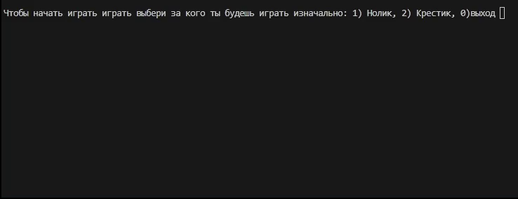

<h1 align="center">
  <span>
    <b style="font-size:2em">Tic-Tac-Toe<br>(Крестики-нолики)</b>
  </span>
</h1>



Этот проект — консольная реализация классической игры "Крестики-нолики" на поле 3x3 на языке Python.  
Данный документ подробно описывает ключевые функции и структуру программы.

---

## 🗂️ Оглавление

- [📝 Описание программы](#описание-программы)
- [🧩 Структура поля](#структура-поля)
- [⚙️ Основные функции](#основные-функции)
  - [✅ check_win(place, player)](#check_winplace-player)
  - [🔳 pole()](#pole)
  - [❌ krest(i, j)](#kresti-j)
  - [⭕ nol(i, j)](#nol-i-j)
- [🔄 Главный игровой цикл](#главный-игровой-цикл)
- [📬 Контакты](#контакты)

---

## 📝 Описание программы

Игрок может выбрать, кем играть — "ноликом" (`⭕`) или "крестиком" (`❌`).  
Игра происходит поочередно, пока кто-то не выиграет или игрок не завершит игру.  
Программа проверяет правильность ввода и не позволяет ходить на занятые клетки.

---

## 🧩 Структура поля

Поле представлено двумерным списком (4x4), где первая строка и первый столбец используются для отображения номеров строк и столбцов:

```python
place = [
    ['', '1', '2', '3'],
    ['1', '', '', ''],
    ['2', '', '', ''],
    ['3', '', '', ''],
]
```

- `ROWS = 4` — количество строк (включая заголовки).
- `COLS = 4` — количество столбцов (включая заголовки).

---

## ⚙️ Основные функции

### ✅ check_win(place, player)

**Описание:**  
Проверяет, выиграл ли игрок `player` (`❌` или `⭕`). Функция анализирует строки, столбцы и обе диагонали.

**Параметры:**
- `place` — игровое поле (двумерный список).
- `player` — символ игрока ('x' или 'o').

**Возвращает:**  
`True`, если у игрока есть выигрышная линия, иначе `False`.

**Пример:**
```python
if check_win(place, 'x'):
    print("X победил!")
```

---

### 🔳 pole()

**Описание:**  
Выводит текущее состояние игрового поля в консоль.

**Параметры:**  
Отсутствуют.

**Пример:**
```python
pole()
```

---

### ❌ krest(i, j)

**Описание:**  
Делает ход "крестика" (`❌`) в позицию `(i, j)`. Проверяет корректность ввода и занятость клетки, при ошибке предлагает ввести координаты повторно.

**Параметры:**
- `i` — номер строки (от 1 до 3).
- `j` — номер столбца (от 1 до 3).

**Особенности:**
- Если клетка занята, запрашивает новые координаты.
- После успешного хода обновляет поле и выводит его.

---

### ⭕ nol(i, j)

**Описание:**  
Делает ход "нолика" (`⭕`) в позицию `(i, j)`. Аналогично функции `krest`, проверяет корректность хода.

**Параметры:**
- `i` — номер строки (от 1 до 3).
- `j` — номер столбца (от 1 до 3).

---

## 🔄 Главный игровой цикл

1. При запуске программы появляется приветствие.
2. Игрок выбирает, за кого играть (нолик, крестик или выход).
3. Ходы совершаются поочередно, после каждого проверяется победа.
4. Проверяется корректность ввода и занятость клетки.
5. Игру можно завершить по желанию игрока.

---

## 📬 Контакты

Автор: Осокин Даниил  
Telegram: [@NomikLover](https://t.me/NomikLover)  
Email: brumis01@mail.ru

---

<sub>🎥 Для GIF используйте свой файл demo.gif или замените ссылку на актуальную.</sub>
